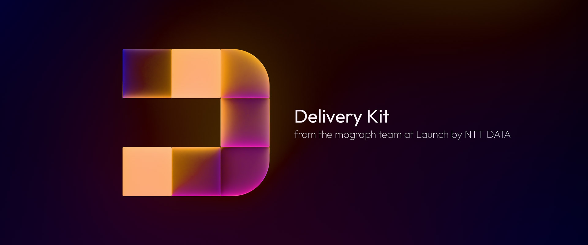
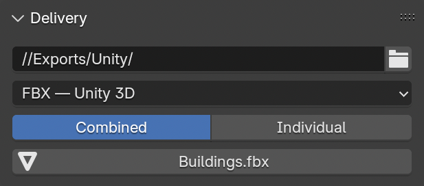

# Launch Delivery Kit — Quick Blender Exports

## Features:

- One-click export to a specified target folder with presets for Unity 3D, Unreal Engine, ThreeJS, 3D printing, CSV files, and more

  

- Features are undergoing a slow evolution, replacing the older plugin structure with individual I/O scripts as time allows; very much a work in progress

## Installation via Extensions Platform:

- Go to Blender Preferences > Get Extensions > Repositories > **＋** > Add Remote Repository
- Set the URL to `https://jeinselen.github.io/Launch-Blender-Extensions/index.json`
- Set the local directory if desired (relative paths seem to fail, try absolute instead)
- Enable `Check for Updates on Start`
- Filter the available extensions for "Launch" and install as needed

## Installation via Download:

- Download the .zip file for a specific kit
- Drag-and-drop the file into Blender

This method will not connect to the centralised repository here on GitHub and updates will not be automatically available. If you don't need easy updates, don't want GitHub servers to be pinged when you start up Blender, or would just like to try some extensions without adding yet another repository to your Blender settings, this is the option for you.

## Notes:

Software is provided as-is with no warranty or provision of suitability. These are internal tools and are shared because we want to support an open community. Bug reports are welcomed, but we cannot commit to fixing or adding features. Not all features may be actively maintained, as they're updated on an as-needed basis.
